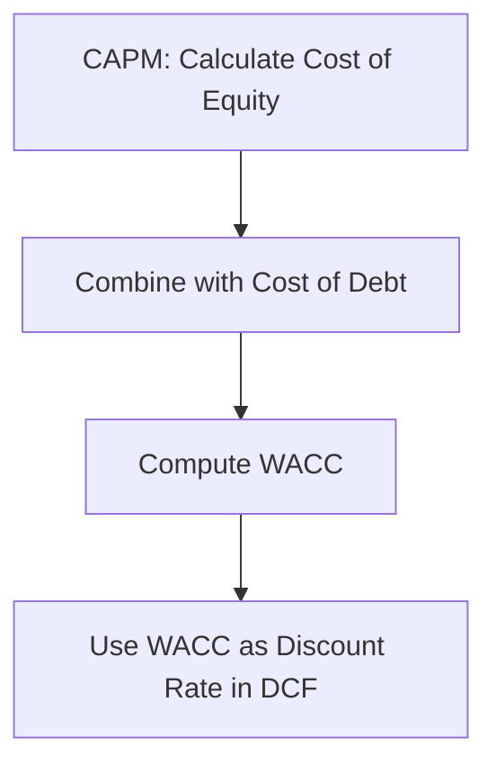

# CAPM and Its Role in Valuation

**Capital Asset Pricing Model (CAPM)** estimates the expected return on equity, which is crucial for determining the discount rate in DCF.
It illustrates the risk of an investment.

**Formula:**
$$
\text{Expected Return or Cost of Equity (Re)} = R_f + \beta \times (R_m - R_f)
$$

Where:
- $R_f$ = Risk-free rate
- $\beta$ = [[#Beta]] (systematic risk measure)
- $R_m$ = Expected market return
- $R_m - R_f$ = Market risk premium

---

### WACC
CAPM helps calculate **Cost of Equity**, a component of **WACC** (Weighted Average Cost of Capital):

$$
\text{WACC} = \frac{E}{V} \times Re + \frac{D}{V} \times Rd \times (1 - T)
$$

Where:
- $E$ = Equity
- $D$ = Debt
- $V$ = Total value (E + D)
- $Rd$ = Cost of debt
- $T$ = Tax rate

See example [[Valuation Example CAPM → WACC → DCF]]

### Flow Diagram: CAPM → WACC → DCF

---

### Beta

**Beta (β)** measures how sensitive an asset’s returns are to the movements of the overall market.
It is a core concept in **CAPM** and modern portfolio theory.
#### **🔍 Interpretation**

- **β = 1** → moves like the market
- **β > 1** → more volatile than the market (high-risk, high-return assets)
- **β < 1** → less volatile than the market (defensive assets)
- **β = 0** → no correlation with the market (e.g., cash)
- **β < 0** → moves opposite to the market (rare; hedging assets)
#### **📐 Formula**

$$\beta = \frac{\text{Cov}(R_{\text{asset}}, R_{\text{market}})}{\text{Var}(R_{\text{market}})}$$
#### **🎯 What Beta captures**

- **Market risk exposure** (systematic risk)
- **Non-diversifiable risk** (cannot be eliminated via diversification)
- Used to compute **cost of equity** in CAPM:

$$E(R) = R_f + \beta (R_m - R_f)$$
#### **🧠 Notes**

- Beta is backward-looking unless adjusted or forecasted.
- Industry betas differ widely (utilities < tech).
- Levered vs unlevered beta matters for valuation and WACC.

---