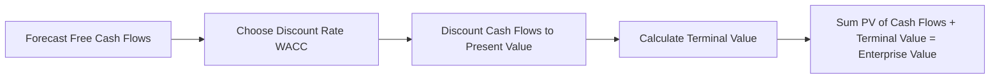

# Intro  - Business valuation methods

A business valuation is the process of determining the [economic value](https://www.investopedia.com/terms/e/economic-value.asp) of a business, oe the company valuation.

> A business valuation typically includes an analysis of the company's:
> - Management
> - Capital structure
> - Future earnings prospects 
> - Market value
> - Assets and liabilities

---
# The methods
## 1. Market capitalization

**Definition:** The total value of a company’s outstanding shares.
$$ MC=N\times P$$
- $MC$ is the market cap
- $N$ is the number of outstanding shares
- $P$ is the market price per common share

**Use Case:** Common for publicly traded companies; reflects market perception.

---

## 2. Times Revenue Method

**Definition:** Valuation based on a multiple of annual revenues.

**Formula:**
$$ \text{Value} = \text{Annual Revenue} \times \text{Revenue Multiple} $$

- $\text{Value}$, Business Value
- $\text{Annual Revenue}$, Trailing Twelve Months, annual revenue, sales
- $\text{Revenue Multiple}$ is a factor derived from market data and industry benchmarks, growth potential, etc

A tech company may be valued at 3x revenue, while a service firm may be valued at 0.5x revenue

---

## 3. Earnings Multiplier

**Definition:** Like Times Revenue Method but using company’s profits instead of sales revenue which is more reliable. It uses P/E Ratio.

**Formula:**
$$ P/E = \frac{\text{Price Per Share}}{\text{Earning Per Share}} $$
- $\text{Earnings per share}$ is the net profits earned by the company per share outstanding in the stock market.
- $\text{Price per share}$ is the market price per common share

**Notes:**
- P/E ratio reflects investor expectations and risk.
- Sensitive to earnings volatility.

---

## 4. Discounted Cash Flow (DCF)

**Definition:** Present value of future cash flows discounted at a required rate of return. It considers inflation.

This formula is derivated from the **present value formula for calculating the time value of money** (VAN en français)

**Formula:**
$$ DCF={\frac {CF_{1}}{(1+r)^{1}}}+{\frac {CF_{2}}{(1+r)^{2}}}+\dotsb +{\frac {CF_{n}}{(1+r)^{n}}} $$
With DPV (Discounted Present Value)
$$
DPV_t = \frac{CF_t}{(1+r)^t}
$$
and compounding returns we get FV (Future Value):
$$\displaystyle FV=DCF\cdot (1+r)^{n}$$
Thus the discounted present value (for one cash flow in one future period) is expressed as:q
$$DCF = \sum_{t=1}^{n} DPV_t = \sum_{t=1}^{n} \frac{CF_t}{(1+r)^t}$$
$$\displaystyle DPV_n={\frac {FV}{(1+r)^{n}}}$$
- $DPV$ - **(Discounted Present Value)** est la **valeur actuelle d’un seul flux futur**.
- $FV$ is the nominal value of a cash flow amount in a future period
- $r$ is the discount rate, which reflects the cost of tying up capital (often WACC)
- $n$ is the time in years before the future cash flow occurs.

---
#### Flow Diagram: DCF Process

---

## 5. Book Value
**Definition:**  Value of shareholders’ equity in a business as shown on the balance sheet statement.

**Formula:**
$$\text{Book value}=\sum Assets -\sum Liabilities$$

**Notes:**
- Reflects historical cost, not market value.
- Useful for asset-heavy businesses.

---

## 6. Liquidation Value
**Definition:** Net cash if assets were sold and liabilities paid off.

**Formula:**
$$
\text{Liquidation Value} = \text{Fair Market Value of Assets} - \text{Liabilities} - \text{Liquidation Costs}
$$

**Use Case:** Worst-case scenario valuation.

---
## 7. Other Common Methods
- **Comparable Company Analysis (CCA):** Uses valuation multiples of similar firms.
- **Precedent Transactions:** Based on historical M&A deals in the same industry.
- **Asset-Based Valuation:** Sum of adjusted asset values minus liabilities.

# Key Takeaways
- **Market Cap** is simple but only for public firms.
- **DCF** is most robust but assumption-heavy.
- **Multiples** are quick but industry-dependent.
- **CAPM** underpins discount rate calculation, impacting all cash-flow-based valuations.