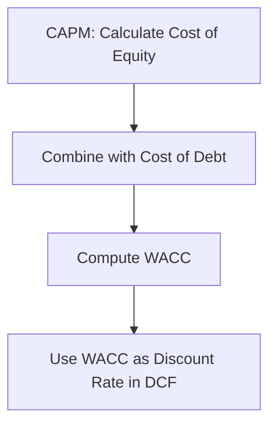

# CAPM and Its Role in Valuation

**Capital Asset Pricing Model (CAPM)** estimates the expected return on equity, which is crucial for determining the discount rate in DCF.

**Formula:**
$$
\text{Expected Return (Re)} = R_f + \beta \times (R_m - R_f)
$$

Where:
- $R_f$ = Risk-free rate
- $\beta$ = Beta (systematic risk measure)
- $R_m$ = Expected market return
- $R_m - R_f$ = Market risk premium

---

### Link to Valuation
CAPM helps calculate **Cost of Equity**, a component of **WACC** (Weighted Average Cost of Capital):

$$
\text{WACC} = \frac{E}{V} \times Re + \frac{D}{V} \times Rd \times (1 - T)
$$

Where:
- $E$ = Equity
- $D$ = Debt
- $V$ = Total value (E + D)
- $Rd$ = Cost of debt
- $T$ = Tax rate

---

### Flow Diagram: CAPM → WACC → DCF

