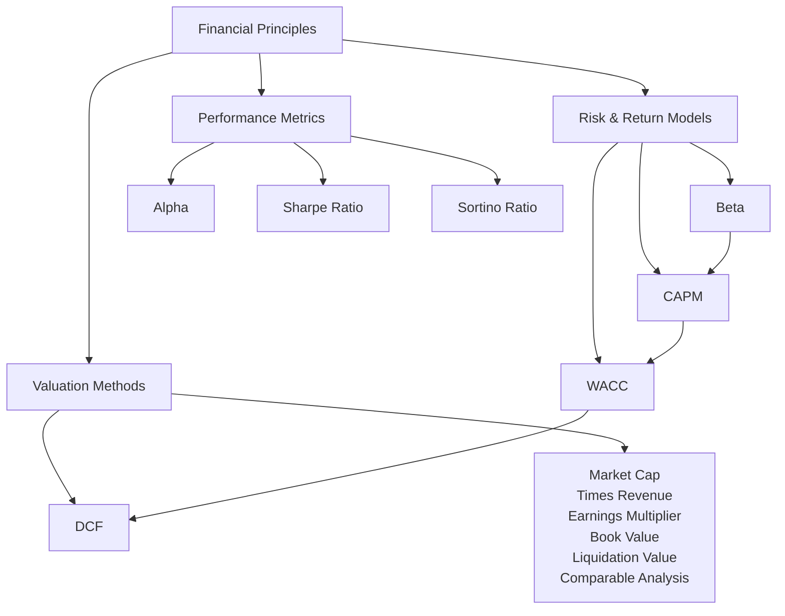

# Mapping

**Global Finance & Valuation Principles Diagram**

This diagram shows the relationships between **risk models**, **valuation methods**, and **performance metrics**.

---

# Performance Metrics

---

# Risks & Returns

---

# Business Valuation

