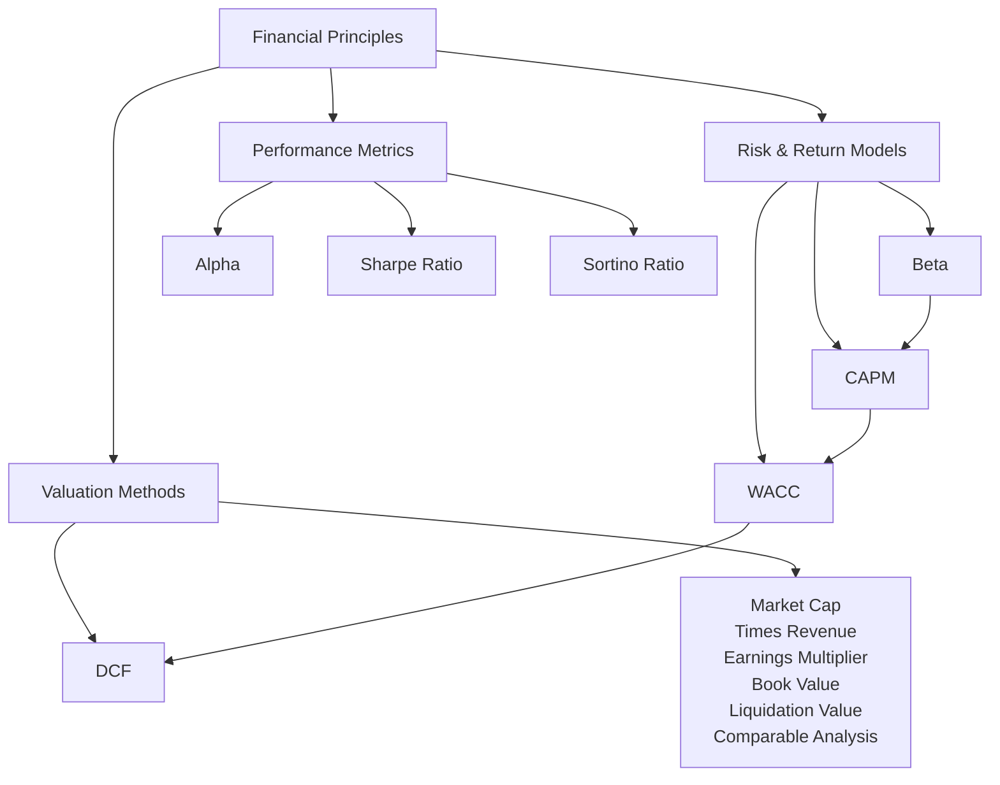

# Mapping

**Global Finance & Valuation Principles Diagram**

This diagram shows the relationships between **risk models**, **valuation methods**, and **performance metrics**.



---

# Performance Metrics

```dataviewjs
/***********************************
 * 🧠 CONFIGURATION
 ***********************************/
const config = {
  filePath: "Apple Notes/Ressources/Professionnel/Training/Economie&Finances/Market & Corporate Finance/Performances Metrics.md", // ← chemin de la note cible
  minLevel: 1, // niveau minimal de heading (1 = H1)
  maxLevel: 3, // niveau maximal de heading (3 = H3)
  showHeader: false // affiche ou non le titre "Titres de : ..."
};

/***********************************
 * 🚀 CODE PRINCIPAL
 ***********************************/
const tfile = app.vault.getAbstractFileByPath(config.filePath);
if (!tfile) {
  dv.paragraph(`❌ Fichier introuvable : ${config.filePath}`);
  return;
}

// Lecture du contenu brut du fichier
const content = await app.vault.read(tfile);

// Expression régulière : repère les lignes qui commencent par des # (titres)
const headingRegex = /^(#{1,6})\s+(.*)$/gm;
let match;
const headings = [];

// Fonction utilitaire : crée une "ancre" propre à partir d’un titre
function makeAnchor(text) {
  return text
    .toLowerCase()                // tout en minuscules
    .normalize("NFD")             // sépare les lettres et les accents
    .replace(/[\u0300-\u036f]/g, "") // enlève les accents
    .replace(/[^\w\s-]/g, "")     // enlève la ponctuation
    .trim()                       // supprime les espaces en trop
    .replace(/\s+/g, "-");        // remplace les espaces par des tirets
}

// On lit le fichier ligne par ligne pour trouver les titres
while ((match = headingRegex.exec(content)) !== null) {
  const level = match[1].length;   // nombre de # → niveau du heading
  const rawText = match[2].trim(); // texte du titre
  const anchor = makeAnchor(rawText);
  headings.push({ level, text: rawText, anchor });
}

// Filtrer selon les niveaux choisis
const visibleHeadings = headings.filter(
  h => h.level >= config.minLevel && h.level <= config.maxLevel
);

if (visibleHeadings.length === 0) {
  dv.paragraph("Aucun titre trouvé avec les niveaux choisis.");
} else {
  if (config.showHeader)
    dv.header(3, `${tfile.basename}`);

  // Création de la liste avec indentation
  const list = visibleHeadings.map(h => {
    const indent = "&nbsp;".repeat((h.level - config.minLevel) * 4);
    // Lien Obsidian : [[Note#Titre|Texte affiché]]
    return `${indent}[[${config.filePath}#${h.text}|${h.text}]]`;
  });

  // Affichage de la liste
  dv.el("div", list.join("<br>"));
}

```

---

# Risks & Returns

```dataviewjs
/***********************************
 * 🧠 CONFIGURATION
 ***********************************/
const config = {
  filePath: "Apple Notes/Ressources/Professionnel/Training/Economie&Finances/Market & Corporate Finance/Risks & Returns.md", // ← chemin de la note cible
  minLevel: 1, // niveau minimal de heading (1 = H1)
  maxLevel: 3, // niveau maximal de heading (3 = H3)
  showHeader: false // affiche ou non le titre "Titres de : ..."
};

/***********************************
 * 🚀 CODE PRINCIPAL
 ***********************************/
const tfile = app.vault.getAbstractFileByPath(config.filePath);
if (!tfile) {
  dv.paragraph(`❌ Fichier introuvable : ${config.filePath}`);
  return;
}

// Lecture du contenu brut du fichier
const content = await app.vault.read(tfile);

// Expression régulière : repère les lignes qui commencent par des # (titres)
const headingRegex = /^(#{1,6})\s+(.*)$/gm;
let match;
const headings = [];

// Fonction utilitaire : crée une "ancre" propre à partir d’un titre
function makeAnchor(text) {
  return text
    .toLowerCase()                // tout en minuscules
    .normalize("NFD")             // sépare les lettres et les accents
    .replace(/[\u0300-\u036f]/g, "") // enlève les accents
    .replace(/[^\w\s-]/g, "")     // enlève la ponctuation
    .trim()                       // supprime les espaces en trop
    .replace(/\s+/g, "-");        // remplace les espaces par des tirets
}

// On lit le fichier ligne par ligne pour trouver les titres
while ((match = headingRegex.exec(content)) !== null) {
  const level = match[1].length;   // nombre de # → niveau du heading
  const rawText = match[2].trim(); // texte du titre
  const anchor = makeAnchor(rawText);
  headings.push({ level, text: rawText, anchor });
}

// Filtrer selon les niveaux choisis
const visibleHeadings = headings.filter(
  h => h.level >= config.minLevel && h.level <= config.maxLevel
);

if (visibleHeadings.length === 0) {
  dv.paragraph("Aucun titre trouvé avec les niveaux choisis.");
} else {
  if (config.showHeader)
    dv.header(3, `${tfile.basename}`);

  // Création de la liste avec indentation
  const list = visibleHeadings.map(h => {
    const indent = "&nbsp;".repeat((h.level - config.minLevel) * 4);
    // Lien Obsidian : [[Note#Titre|Texte affiché]]
    return `${indent}[[${config.filePath}#${h.text}|${h.text}]]`;
  });

  // Affichage de la liste
  dv.el("div", list.join("<br>"));
}

```

---

# Business Valuation
```dataviewjs
/***********************************
 * 🧠 CONFIGURATION
 ***********************************/
const config = {
  filePath: "Apple Notes/Ressources/Professionnel/Training/Economie&Finances/Market & Corporate Finance/How to value a company.md", // ← chemin de la note cible
  minLevel: 1, // niveau minimal de heading (1 = H1)
  maxLevel: 3, // niveau maximal de heading (3 = H3)
  showHeader: true // affiche ou non le titre "Titres de : ..."
};

/***********************************
 * 🚀 CODE PRINCIPAL
 ***********************************/
const tfile = app.vault.getAbstractFileByPath(config.filePath);
if (!tfile) {
  dv.paragraph(`❌ Fichier introuvable : ${config.filePath}`);
  return;
}

// Lecture du contenu brut du fichier
const content = await app.vault.read(tfile);

// Expression régulière : repère les lignes qui commencent par des # (titres)
const headingRegex = /^(#{1,6})\s+(.*)$/gm;
let match;
const headings = [];

// Fonction utilitaire : crée une "ancre" propre à partir d’un titre
function makeAnchor(text) {
  return text
    .toLowerCase()                // tout en minuscules
    .normalize("NFD")             // sépare les lettres et les accents
    .replace(/[\u0300-\u036f]/g, "") // enlève les accents
    .replace(/[^\w\s-]/g, "")     // enlève la ponctuation
    .trim()                       // supprime les espaces en trop
    .replace(/\s+/g, "-");        // remplace les espaces par des tirets
}

// On lit le fichier ligne par ligne pour trouver les titres
while ((match = headingRegex.exec(content)) !== null) {
  const level = match[1].length;   // nombre de # → niveau du heading
  const rawText = match[2].trim(); // texte du titre
  const anchor = makeAnchor(rawText);
  headings.push({ level, text: rawText, anchor });
}

// Filtrer selon les niveaux choisis
const visibleHeadings = headings.filter(
  h => h.level >= config.minLevel && h.level <= config.maxLevel
);

if (visibleHeadings.length === 0) {
  dv.paragraph("Aucun titre trouvé avec les niveaux choisis.");
} else {
  if (config.showHeader)
    dv.header(3, `${tfile.basename}`);

  // Création de la liste avec indentation
  const list = visibleHeadings.map(h => {
    const indent = "&nbsp;".repeat((h.level - config.minLevel) * 4);
    // Lien Obsidian : [[Note#Titre|Texte affiché]]
    return `${indent}[[${config.filePath}#${h.text}|${h.text}]]`;
  });

  // Affichage de la liste
  dv.el("div", list.join("<br>"));
}

```
